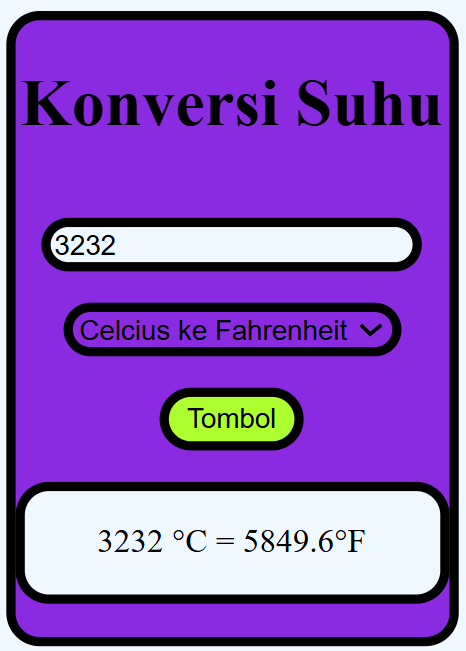

ini merupakan praktek dari DOM pertama, untuk membuat:
1. tampilan html dan css yg menampilkan input dari nilai berupa number dan tipe berupa string
2. setelah itu di proses dengan DOM JavaScript untuk merubah dari Celsius ke farentheit atau ke Kelvin menggunakan if else
3. setlah mengeluarkan hasil berTipe string di tampilkan di paragraf dngn id 

Hasil = 